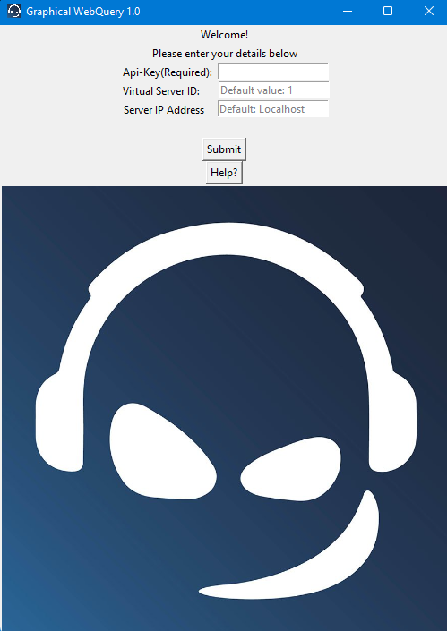
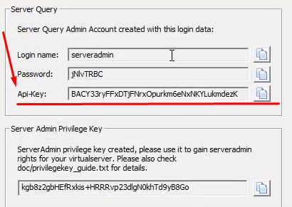
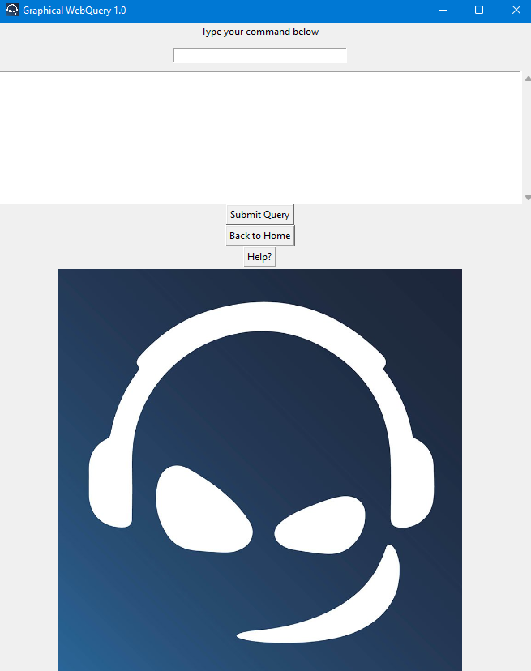
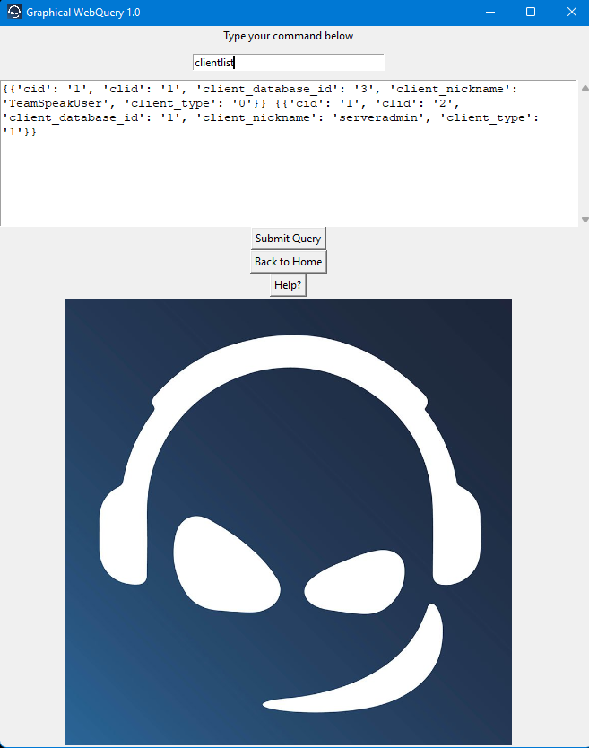

# Graphical-WebQuery
A graphical(GUI) implementation of Teamspeak Web Query

Instructions:
1. Enter your API key, Virtual Server ID and Teamspeak server address in the entry fields and press the submit button. You got your API-Key when you created your teamspeak server(see image)

2. Write your commands separated by a whitespace and press Send Query. Single-word commands have no parameters and require no whitespace

  

3. Read the response from the server in the text area. The response is in the form of a JSON response object

  

## Example commands:
### Single-word commands
serverlist

clientlist

serverinfo
### Multi-word commands
channelcreate channel_name hello_world

clientpoke clid 6 msg Hey
